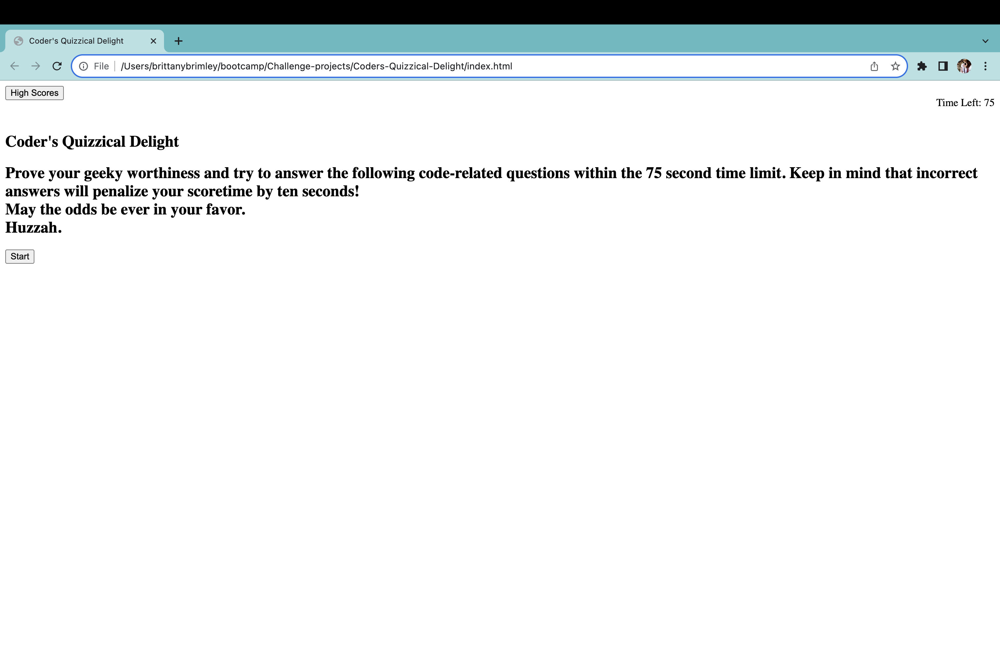

# Coders-Quizzical-Delight
A simple code quiz showcasing Web API usage
## Links
[GitHub Repo](https://github.com/Git-BritHub/Coders-Quizzical-Delight.git)
 
[Live URL]()

## Description
A coder wanting to test their knowledge of basic programming skills may take this quiz for their own ammusement, as well as help prepare them for future interview assessments. This timed quiz is given a 75 second time limit and subtracts 10 seconds every time a question is answered incorrectly. Once completed (or when time runs out), they will be presented with their score and will have the chance to save it to the website's highscore page. This will allow them to guage their progress compared to their peers. 

## Usage

## Credits
Sought guidance and feedback from the U of U's software developer tutors.